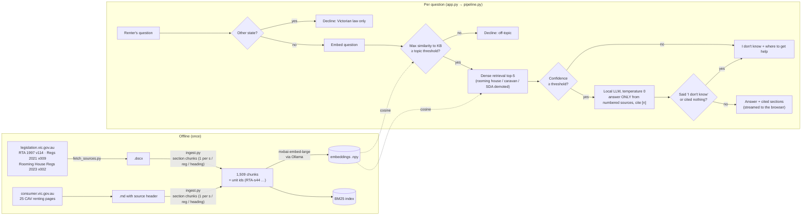

# Architecture

| Component | File | Notes |
|---|---|---|
| Source download | `fetch_sources.py`, `sources.yaml` | URLs, versions, access dates, terms of use |
| Parsing + chunking | `ingest.py` | Reads the authorised Word files paragraph by paragraph; keeps section numbers, Part and Division; skips side notes, transitional provisions and forms |
| Retrieval | `retrieval.py` | BM25, dense, hybrid (RRF and weighted sum), embedding cache, tenure demotion |
| Pipeline | `pipeline.py` | Gates, prompt, citation check, streaming |
| Experiments | `run_retrieval.py`, `run_eval.py` | Dev for choices, test once for reporting |
| App | `app.py`, `templates/`, `static/style.css` | Flask, server-rendered, no JS framework, no animation |

**Speed.** On an 8 GB M1 MacBook Air: start-up about 2 s (cached embeddings), retrieval and gates under 0.1 s.
The first answer token arrives in about 2–4 s once the LLM is warm, and the app warms it at start-up.
Off-topic and other-state questions are refused instantly, without calling the LLM.
